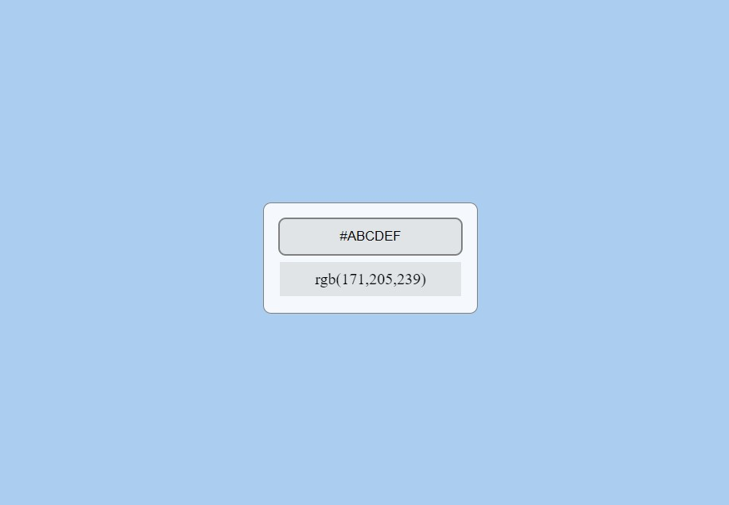
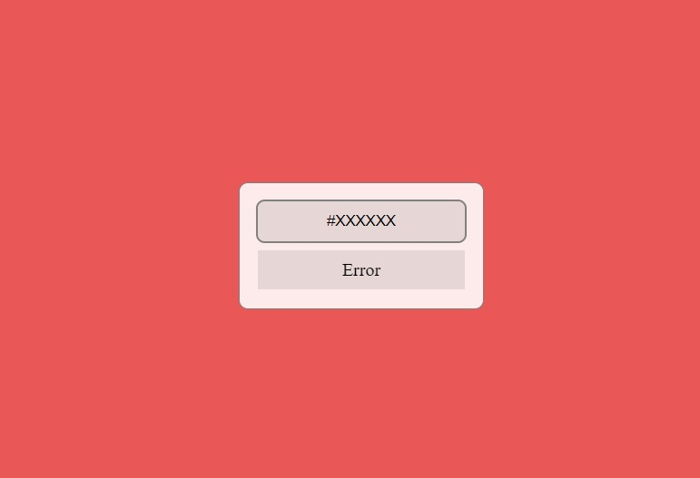

Конвертер цветов из HEX в RGB
===

## Интерфейс конвертера

При правильном вводе цвета он показывает его представление в формате RGB и меняет цвет фона на заданный цвет.
Нужно ввести 7 символов (включая решётку), чтобы получить результат.

При вводе неправильного цвета в формате HEX показывается ошибка:

